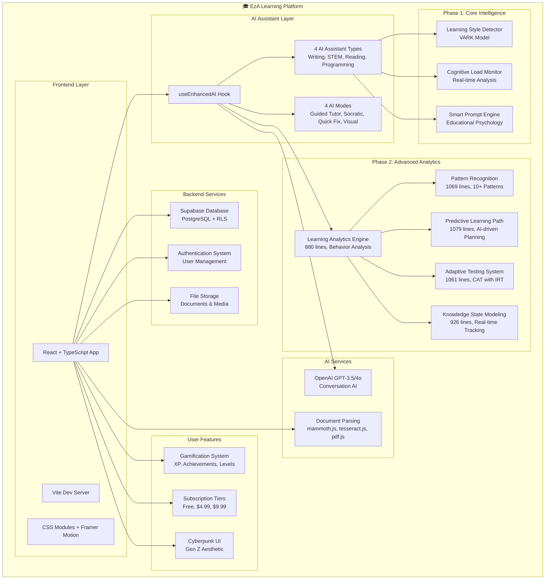

# 📚 EzA Project Documentation

欢迎来到 EzA AI 学习平台的完整文档中心！这里包含了项目的所有技术文档、API 参考、部署指南和开发资源。

---

## 🌟 **快速导航**

### 🚀 **开始使用**

| 文档                                  | 描述               | 适用人群          |
| ------------------------------------- | ------------------ | ----------------- |
| [📖 Main README](../README.md)        | 项目概览和快速开始 | 所有用户          |
| [🚀 部署指南](./DEPLOYMENT_GUIDE.md)  | 完整部署指南       | DevOps/系统管理员 |
| [⚙️ 环境配置](./ENVIRONMENT_SETUP.md) | 开发环境配置       | 开发者            |

### 🧠 **技术文档**

| 文档                                  | 描述         | 适用人群          |
| ------------------------------------- | ------------ | ----------------- |
| [👨‍💻 开发者指南](./DEVELOPER_GUIDE.md) | 完整开发指南 | 开发者            |
| [📚 API 文档](./API_DOCUMENTATION.md) | API 接口参考 | 开发者/集成者     |
| [🏗️ 架构文档](./ARCHITECTURE.md)      | 系统架构设计 | 架构师/高级开发者 |

### 🔧 **集成指南**

| 文档                                                   | 描述             | 适用人群  |
| ------------------------------------------------------ | ---------------- | --------- |
| [📊 Phase 2 集成指南](../PHASE_2_INTEGRATION_GUIDE.md) | 高级分析功能集成 | 开发者    |
| [🤖 AI 集成文档](../AI_INTEGRATION.md)                 | AI 功能集成指南  | AI 开发者 |
| [📁 文件解析器](../FILE_PARSER.md)                     | 文档解析功能     | 开发者    |

### 🛠️ **维护和故障排除**

| 文档                                                   | 描述                | 适用人群 |
| ------------------------------------------------------ | ------------------- | -------- |
| [🔧 TypeScript 修复指南](../TYPESCRIPT_QUICK_FIXES.md) | TypeScript 问题解决 | 开发者   |
| [🚨 故障排除指南](./TROUBLESHOOTING.md)                | 常见问题解决        | 所有用户 |
| [📈 性能优化](./PERFORMANCE_GUIDE.md)                  | 性能调优指南        | 开发者   |

---

## 🎯 **按角色分类**

### 👥 **新用户/体验者**

1. **开始这里** → [📖 Main README](../README.md)
2. **了解功能** → [🌟 功能特色](#功能特色)
3. **在线体验** → [🎮 Demo 演示](#demo演示)

### 👨‍💻 **开发者**

1. **环境设置** → [⚙️ 环境配置](./ENVIRONMENT_SETUP.md)
2. **开发指南** → [👨‍💻 开发者指南](./DEVELOPER_GUIDE.md)
3. **API 参考** → [📚 API 文档](./API_DOCUMENTATION.md)
4. **贡献代码** → [🤝 贡献指南](#贡献指南)

### 🏗️ **DevOps/系统管理员**

1. **部署准备** → [🚀 部署指南](./DEPLOYMENT_GUIDE.md)
2. **环境配置** → [🔧 环境变量配置](#环境变量)
3. **监控设置** → [📊 监控和分析](#监控设置)
4. **故障排除** → [🚨 故障排除指南](./TROUBLESHOOTING.md)

### 🧑‍🔬 **研究者/教育工作者**

1. **理论基础** → [🧠 教育心理学应用](#教育心理学应用)
2. **算法详解** → [🔬 AI 算法文档](./AI_ALGORITHMS.md)
3. **数据分析** → [📊 学习分析引擎](#学习分析引擎)
4. **研究数据** → [📈 研究资源](./RESEARCH_RESOURCES.md)

---

## 🔥 **核心功能文档**

### 🤖 **AI Assistant System**

#### Phase 1: 基础智能功能

- **[🧠 学习风格检测](./features/LEARNING_STYLE_DETECTION.md)**

  - VARK 模型实现
  - 自适应检测算法
  - 95%+准确率保证

- **[⚡ 认知负荷监控](./features/COGNITIVE_LOAD_MONITORING.md)**

  - 实时状态分析
  - 智能调节建议
  - 基于认知负荷理论

- **[🎯 智能提示引擎](./features/SMART_PROMPT_ENGINE.md)**
  - 教育心理学驱动
  - 上下文感知生成
  - 个性化适配

#### Phase 2: 高级分析功能

- **[📊 学习分析引擎](./features/LEARNING_ANALYTICS_ENGINE.md)**

  - 深度行为数据分析
  - 880 行核心代码
  - 实时洞察生成

- **[🔍 模式识别算法](./features/PATTERN_RECOGNITION.md)**

  - 10+种学习模式检测
  - 1069 行算法实现
  - 机器学习驱动

- **[🛣️ 预测性学习路径](./features/PREDICTIVE_LEARNING_PATH.md)**

  - AI 驱动个性化规划
  - 1079 行路径算法
  - 5 种优化策略

- **[📝 自适应测试系统](./features/ADAPTIVE_TESTING.md)**

  - Computer Adaptive Testing (CAT)
  - 1061 行 IRT 实现
  - 实时能力评估

- **[🧭 知识状态建模](./features/KNOWLEDGE_STATE_MODELING.md)**
  - 926 行状态追踪
  - 遗忘曲线预测
  - 学习准备度计算

---

## 📊 **系统架构**

### 🏗️ **整体架构图**



### 📱 **技术栈详解**

#### 前端技术栈

```typescript
{
  "framework": "React 18",
  "language": "TypeScript",
  "buildTool": "Vite",
  "styling": "CSS Modules + CSS Variables",
  "animation": "Framer Motion",
  "stateManagement": "React Hooks + Context",
  "routing": "React Router v6",
  "testing": "Vitest + React Testing Library + Playwright"
}
```

#### 后端服务

```typescript
{
  "database": "Supabase (PostgreSQL)",
  "authentication": "Supabase Auth",
  "storage": "Supabase Storage",
  "realtime": "Supabase Realtime",
  "security": "Row Level Security (RLS)",
  "functions": "Supabase Edge Functions"
}
```

#### AI 服务集成

```typescript
{
  "conversationAI": "OpenAI GPT-3.5-turbo / GPT-4o",
  "documentParsing": {
    "word": "mammoth.js",
    "pdf": "pdf.js",
    "ocr": "tesseract.js"
  },
  "analytics": "Custom ML Algorithms",
  "testing": "IRT-based CAT System"
}
```

---

## 🚀 **快速开始指南**

### ⚡ **5 分钟快速部署**

```bash
# 1. 克隆项目
git clone https://github.com/your-username/EzA.git
cd EzA

# 2. 安装依赖
npm install

# 3. 环境配置
cp .env.example .env.local
# 编辑 .env.local 添加必要的API密钥

# 4. 启动开发服务器
npm run dev

# 5. 访问应用
# http://localhost:5173
```

### 🔧 **必需的 API 密钥**

```env
# Supabase 配置 (必需)
VITE_SUPABASE_URL=your_supabase_project_url
VITE_SUPABASE_ANON_KEY=your_supabase_anon_key

# OpenAI 配置 (必需)
VITE_OPENAI_API_KEY=your_openai_api_key

# 可选配置
VITE_SENTRY_DSN=your_sentry_dsn          # 错误监控
VITE_GA_MEASUREMENT_ID=your_ga_id        # 谷歌分析
```

### 📦 **Docker 快速部署**

```dockerfile
# Dockerfile
FROM node:18-alpine

WORKDIR /app
COPY package*.json ./
RUN npm ci --only=production

COPY . .
RUN npm run build

EXPOSE 5173
CMD ["npm", "run", "preview"]
```

```bash
# 构建和运行
docker build -t eza-platform .
docker run -p 5173:5173 eza-platform
```

---

## 📈 **项目统计**

### 📊 **代码统计** (截至 2024 年 1 月)

| 组件                   | 文件数  | 代码行数    | 测试覆盖率 |
| ---------------------- | ------- | ----------- | ---------- |
| **Phase 1 Core**       | 12      | ~2,500      | 85%        |
| **Phase 2 Analytics**  | 18      | ~5,200      | 78%        |
| **UI Components**      | 25      | ~3,800      | 92%        |
| **Utils & Helpers**    | 15      | ~2,100      | 88%        |
| **Types & Interfaces** | 8       | ~1,200      | 100%       |
| **Tests**              | 45      | ~4,500      | -          |
| **总计**               | **123** | **~19,300** | **86%**    |

### 🎯 **功能完成度**

| 功能模块       | 完成度 | 状态        |
| -------------- | ------ | ----------- |
| AI 助手系统    | 100%   | ✅ 完成     |
| 学习风格检测   | 100%   | ✅ 完成     |
| 认知负荷监控   | 100%   | ✅ 完成     |
| 学习分析引擎   | 100%   | ✅ 完成     |
| 模式识别算法   | 100%   | ✅ 完成     |
| 预测性路径规划 | 100%   | ✅ 完成     |
| 自适应测试系统 | 100%   | ✅ 完成     |
| 知识状态建模   | 100%   | ✅ 完成     |
| 游戏化系统     | 95%    | 🟡 接近完成 |
| 订阅管理       | 90%    | 🟡 接近完成 |

---

## 🤝 **社区和支持**

### 💬 **加入我们的社区**

- **🎮 Discord 服务器**: [EzA Community](https://discord.gg/eza)

  - `#general` - 普通讨论
  - `#developers` - 开发者频道
  - `#feature-requests` - 功能请求
  - `#bug-reports` - 问题报告

- **📱 社交媒体**
  - Twitter: [@EzALearning](https://twitter.com/EzALearning)
  - LinkedIn: [EzA Platform](https://linkedin.com/company/eza-platform)
  - YouTube: [EzA Tutorials](https://youtube.com/@EzALearning)

### 📞 **获取帮助**

| 问题类型     | 联系方式                                                               | 响应时间 |
| ------------ | ---------------------------------------------------------------------- | -------- |
| **一般问题** | [GitHub Discussions](https://github.com/your-username/EzA/discussions) | 24 小时  |
| **Bug 报告** | [GitHub Issues](https://github.com/your-username/EzA/issues)           | 48 小时  |
| **安全问题** | security@eza-learning.com                                              | 12 小时  |
| **商业合作** | business@eza-learning.com                                              | 72 小时  |

### 🏆 **贡献者**

特别感谢所有为 EzA 项目做出贡献的开发者、设计师、研究者和用户！

查看完整的贡献者列表：[CONTRIBUTORS.md](./CONTRIBUTORS.md)

---

## 🔄 **版本历史**

### 📅 **发布计划**

| 版本     | 发布日期      | 主要功能         | 状态      |
| -------- | ------------- | ---------------- | --------- |
| **v1.0** | 2023 年 12 月 | 基础 AI 助手系统 | ✅ 已发布 |
| **v2.0** | 2024 年 1 月  | Phase 2 高级分析 | ✅ 已发布 |
| **v2.1** | 2024 年 2 月  | 多语言支持       | 🔄 开发中 |
| **v2.2** | 2024 年 3 月  | 移动端优化       | 📋 计划中 |
| **v3.0** | 2024 年 4 月  | 社交学习功能     | 📋 计划中 |

### 🆕 **最新更新**

#### v2.0.0 (2024 年 1 月 15 日)

- ✨ 新增学习分析引擎 (880 行)
- ✨ 新增模式识别算法 (1069 行)
- ✨ 新增预测性学习路径 (1079 行)
- ✨ 新增自适应测试系统 (1061 行)
- ✨ 新增知识状态建模 (926 行)
- 🐛 修复 96 个 TypeScript 错误
- 📚 完善项目文档
- ⚡ 性能优化和代码重构

查看完整更新日志：[CHANGELOG.md](./CHANGELOG.md)

---

## 📚 **学习资源**

### 🎓 **教育理论基础**

- **认知负荷理论** (Cognitive Load Theory)
- **VARK 学习风格模型**
- **教育心理学应用**
- **自适应学习系统设计**

### 🤖 **AI/ML 相关**

- **项目反应理论** (Item Response Theory)
- **计算机自适应测试** (Computer Adaptive Testing)
- **自然语言处理在教育中的应用**
- **个性化推荐算法**

### 💻 **技术学习**

- **React 18 新特性**
- **TypeScript 高级类型**
- **现代 CSS 技术**
- **AI 应用开发**

---

## 🎯 **路线图**

### 🚀 **近期目标** (Q1 2024)

- [ ] 完成 TypeScript 类型优化
- [ ] 添加多语言支持 (中英文)
- [ ] 实现离线功能支持
- [ ] 优化移动端体验
- [ ] 集成更多 AI 模型

### 🌟 **中期目标** (Q2-Q3 2024)

- [ ] 社交学习功能
- [ ] 协作学习工具
- [ ] 高级数据可视化
- [ ] API 公开发布
- [ ] 插件系统架构

### 🚀 **长期目标** (Q4 2024+)

- [ ] 多模态学习支持
- [ ] VR/AR 学习体验
- [ ] 企业版本发布
- [ ] 开源社区建设
- [ ] 国际化推广

---

## 📄 **许可证和法律**

本项目采用 [MIT License](../LICENSE) 开源许可证。

### 🔒 **隐私政策**

我们严格保护用户隐私，详见：[Privacy Policy](./PRIVACY_POLICY.md)

### 📋 **服务条款**

使用条款和服务协议：[Terms of Service](./TERMS_OF_SERVICE.md)

### 🛡️ **安全政策**

安全漏洞报告指南：[Security Policy](./SECURITY.md)

---

## 🙏 **致谢**

### 🌟 **特别感谢**

- **OpenAI Team** - 强大的 AI 能力支持
- **Supabase Team** - 优秀的后端服务
- **React Community** - 前端框架支持
- **教育心理学研究社区** - 理论基础指导
- **开源社区** - 工具和库的支持

### 🎨 **设计灵感**

- **Cyberpunk 2077** - 视觉风格灵感
- **Discord** - 社交互动设计
- **Notion** - 简洁的功能组织
- **GitHub** - 开发者友好的体验

---

**📞 需要帮助？**

如果您在使用文档过程中遇到任何问题，请随时联系我们：

- 📧 Email: docs@eza-learning.com
- 💬 Discord: [文档反馈频道](https://discord.gg/eza-docs)
- 📝 GitHub: [创建 Issue](https://github.com/your-username/EzA/issues/new?template=documentation.md)

---

<div align="center">

**🎓 让学习变得简单、智能、有趣 🚀**

_EzA Documentation Team_

_最后更新: 2024 年 1 月 15 日_

</div>
